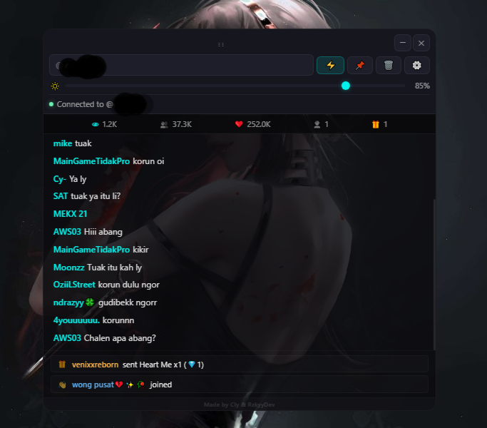
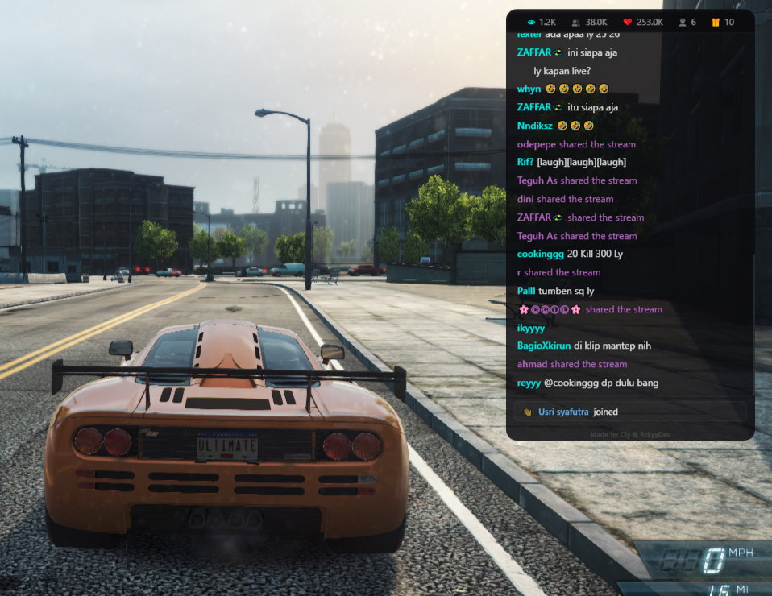
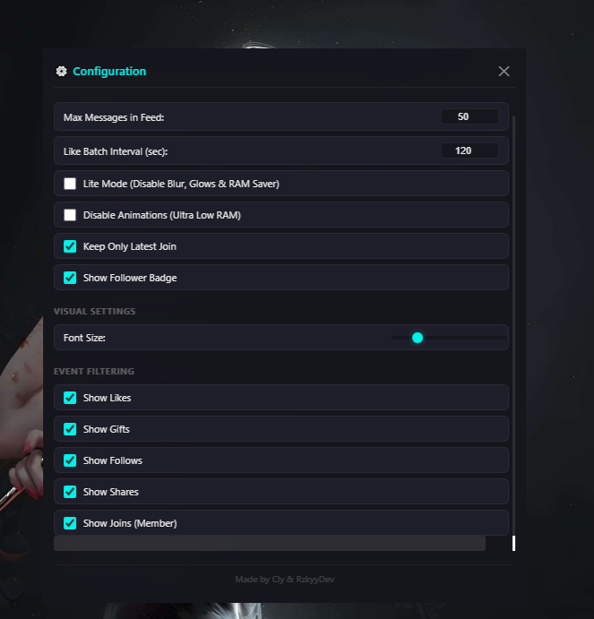

<p align="center">
  
</p>

<h1 align="center">TikOverlay</h1>

<p align="center">
  A lightweight, transparent, and customizable TikTok Live chat overlay for Windows.
</p>

<p align="center">
  
  
  
</p>


## Features

### Real-Time Live Connection
Connects directly to any public TikTok Live stream via WebSocket using the `piratetok-live-js` client. Captures live comments, emotes, barrage announcements, member joins, shares, follows, and gift animations with zero external server dependencies.

* **How to use:** Enter the target TikTok username (with or without `@`) into the top control bar and click the Connect button (or press `Enter`).

### Transparent Gaming Overlay
Designed as a frameless, transparent window that floats above all other open windows. Can be pinned to enable `always-on-top` and `click-through` mode, allowing mouse clicks and game controls to pass directly through the chat box during gameplay.

* **How to use:** Click the Pin button in the control bar or press the global keyboard shortcut `Ctrl+Shift+P` anywhere on your desktop to toggle click-through mode.

### Opacity Adjustment
Allows fine-tuning the background transparency of the chat box from 10% to 100% so that game visuals remain clearly visible underneath while maintaining text legibility.

* **How to use:** Drag the opacity slider in the top control bar between `10%` and `100%`.

### Smart Connection Protection
Prevents accidental connection loops, UI freezing, and server rate-limiting by enforcing strict request locking and cooldowns across both the frontend and backend.

* **How to use:** Operates automatically. If a connection attempt is in progress or fails, the interface locks duplicate requests and displays a visual cooldown countdown timer before allowing subsequent retries.

### Anti-Bot Protection
Bypasses TikTok web application firewall (WAF) checks (`statusCode 10001`, `403`, or blocked requests) using an optimized background headless Chromium instance (`ensureTtwidAndCookies`) that automatically scrapes session tokens (`ttwid`, `msToken`), rotates Chrome User-Agent headers, and routes traffic through Electron's native network stack (`net.fetch`).

* **How to use:** Runs automatically whenever a connection is initiated or when an anti-bot check is detected during an active session.

### Live Statistics
Displays real-time stream analytics at the top of the chat feed, updating instantly as broadcast events occur.

* **Metrics tracked:**
  * Current active room viewers
  * Total cumulative viewers (`roomUserSeq`)
  * Total likes received (`likeCount`)
  * Total new followers gained during the session
  * Total diamond value of gifts received

### Performance Settings
Provides a built-in configuration panel to adjust UI appearance, RAM usage, and chat clutter. Settings are automatically saved to local storage (`localStorage`).

* **How to use:** Click the Settings (`Control Panel`) button in the control bar to open the configuration modal.

### Chat History
Automatically saves chat logs and counter statistics (`chatHistory`) in memory when switching between different TikTok usernames, allowing seamless navigation back to previous channels without losing context during a single application run.

* **How to use:** Switch usernames in the input box; returning to a previously visited username restores its chat feed instantly.

### System Tray Support
Runs unobtrusively in the Windows system tray with a custom 16x16 RGBA icon. Provides quick right-click menu actions to hide/show the overlay, check connection status, pin/unpin the window, or quit the application.

* **How to use:** Right-click the system tray icon in the Windows taskbar or use `Ctrl+Shift+P` to toggle window pinning.

---

## Advantages

* **Ultra-Low Resource Usage:** Configured with aggressive V8 heap limits (`--max-old-space-size=256`), GPU shader disk cache disabling, and background networking throttling (`--disable-background-networking`) to ensure minimal impact on gaming FPS.
* **Lite Mode & Zero-Animation Modes:** Built-in toggles allow disabling CSS blur effects, glows, and DOM animations, cutting CPU and RAM footprint further on lower-end hardware.
* **Anti-Bot Resilience:** Unlike simple REST scrapers that fail repeatedly against TikTok protection mechanisms, the app leverages full browser session cookies and User-Agent pools to maintain stable long-duration connections.
* **Non-Intrusive Gameplay:** Click-through forwarding ensures that high-action gaming moments are never interrupted by accidental window focus changes.
* **Standalone Portability:** Can be compiled as either a standard Windows installer (`NSIS`) or a zero-installation portable executable.

---

## Installation

### Requirements
* **Operating System:** Windows 10 or Windows 11 (64-bit)
* **Runtime Environment:** Node.js v18.0.0 or higher
* **Package Manager:** npm (bundled with Node.js)

### Dependencies
The project relies on the following core production dependencies:
* `piratetok-live-js` (`^0.1.5`): Unofficial TikTok Live WebSocket connection client.
* `undici` (`^8.7.0`): High-performance HTTP/1.1 and HTTP/2 client for Node.js.
* `electron` (`^35.7.5`): Desktop application framework.

### Installation Steps
1. Clone or download the project repository to your local machine:
   ```bash
   git clone https://github.com/rzkyydev/tikoverlay.git
   cd tikoverlay
   ```
2. Install project dependencies:
   ```bash
   npm install
   ```

### Run Instructions
To run the application locally in standard production mode:
```bash
npm start
```

To run with developer tools enabled (`DevTools` open by default):
```bash
npm run dev
```

### Build Instructions
To compile standalone Windows executables using `electron-builder`:
```bash
npm run build
```
Upon completion, output files will be generated in the `dist/` directory:
* `TikOverlay-Setup.exe` (Standard NSIS installer)
* `TikOverlay-Portable.exe` (Standalone portable application)

---

## Usage

### First-Time User Guide
1. Launch the application (`TikOverlay.exe` or via `npm start`).
2. A welcome screen will appear on first startup; click anywhere inside the window to dismiss it.
3. In the top control bar, enter the username of a creator currently broadcasting live on TikTok (for example, `username` or `@username`).
4. Click the **Connect** button (lightning icon) or press **Enter**.
5. The status bar will indicate `Connecting to @username...` while the background engine retrieves session tokens. Once established, the status dot turns green and displays `Connected to @username`.
6. Adjust the **Opacity Slider** to your preferred background transparency level.
7. Click the **Pin** button (`Ctrl+Shift+P`). A toast notification will appear confirming that click-through mode is active. You can now launch your game and play while the chat floats seamlessly on top.
8. To reposition or adjust settings while pinned, press `Ctrl+Shift+P` again to unpin the window and restore mouse interaction.

### Workflow & Control Bar Guide
| Control | Action | Description |
| :--- | :--- | :--- |
| **Drag Handle (`⋮⋮`)** | Click & Drag | Reposition the overlay anywhere across your monitor(s). |
| **Username Input** | Text Field | Enter target TikTok username (at symbol `@` is automatically stripped). |
| **Connect (`🔴`)** | Click / Enter | Connects to or disconnects from the live stream. |
| **Pin (`📌`)** | Click / `Ctrl+Shift+P` | Toggles window pinning (Always on Top + Click-through mouse pass). |
| **Clear (`🗑️`)** | Click | Clears all current chat messages, notifications, and counter statistics. |
| **Settings (`⚙️`)** | Click | Opens the configuration modal panel. |
| **Opacity Slider** | Range (`10%–100%`) | Dynamically adjusts the background opacity of the overlay. |
| **Minimize (`─`)** | Click | Minimizes the overlay to the Windows taskbar and system tray. |
| **Close (`✕`)** | Click | Closes the window and disconnects active sessions. |

---

## Download

Download the latest version from the GitHub Releases page.

- **Windows Installer (.exe)** – Recommended for most users.
- **Portable (.exe)** – Run without installation.

> https://github.com/rzkyydev/tikoverlay/releases

---

## Configuration

All configuration options are accessible directly through the UI **Settings Panel** and are persisted across sessions in `localStorage` under the key `tikoverlay_config`.

### Performance Options
| Option | Default | Description |
| :--- | :--- | :--- |
| **Max Messages in Feed** | `50` | Maximum number of DOM nodes kept inside the chat history before pruning oldest entries (`5` to `200`). |
| **Like Batch Interval (sec)** | `120` | Accumulates rapid incoming likes and displays a single summarized message every `N` seconds (`1` to `600` seconds). |
| **Lite Mode** | `false` | Disables background blurs, glow effects, and automatically caps max feed messages to `25` to save RAM. |
| **Disable Animations** | `false` | Disables CSS slide/fade transitions for ultra-low CPU utilization on legacy PCs. |
| **Keep Only Latest Join** | `true` | When enabled, room member join notifications update a single dedicated bar (`#latest-join`) instead of flooding the main chat log. |
| **Show Follower Badge** | `true` | Displays a heart badge (`♥`) next to usernames of viewers who follow the streamer. |

### Visual Settings
| Option | Default | Description |
| :--- | :--- | :--- |
| **Font Size** | `12px` | Adjusts the text size of all chat messages and username labels (`9px` to `24px`). |

### Event Filtering
| Option | Default | Description |
| :--- | :--- | :--- |
| **Show Likes** | `true` | Toggles rendering of batched like summaries in the chat feed. |
| **Show Gifts** | `true` | Toggles animated notification cards when viewers send TikTok gifts (expensive gifts `≥100 diamonds` are highlighted). |
| **Show Follows** | `true` | Toggles floating notification alerts when viewers follow the channel during the broadcast. |
| **Show Shares** | `true` | Toggles notifications when viewers share the live stream. |
| **Show Joins (Member)** | `true` | Toggles notifications when new viewers enter the live room. |

---

## Screenshots

### Main Chat Overlay

<p align="center">
  
</p>

<p align="center">
  <sub>Displays live chat messages with real-time viewer, like, follower, and diamond statistics while staying on top of your game.</sub>
</p>

### Pinned Click-Through Mode

<p align="center">
  
</p>

<p align="center">
  <sub>Allows the overlay to remain visible while mouse and keyboard input pass directly to the game.</sub>
</p>

### Settings Panel

<p align="center">
  
</p>

<p align="center">
  <sub>Customize appearance, performance, memory usage, and event visibility to match your streaming setup.</sub>
</p>

---

## FAQ

### How do I move the overlay while it is pinned?

Press **Ctrl + Shift + P** to temporarily disable click-through mode, reposition the window, then press the shortcut again to re-enable it.

### Why does the Connect button show a countdown?

A short cooldown prevents repeated connection attempts, reducing the chance of rate limiting or accidental spam requests.

### Do I need to sign in to my TikTok account?

No. TikOverlay connects as an anonymous public viewer and does not require your TikTok account credentials.

### Can I monitor multiple streamers at the same time?

Each application instance supports one live stream at a time. Switching usernames preserves chat history during the current session.

---

## Troubleshooting

### GPU Cache Errors

**Cause:** Cached Chromium files may become corrupted after an unexpected shutdown.

**Solution:** Close all running instances and delete the `GPUCache` folder inside the application's data directory. TikOverlay also attempts to clean this automatically on startup.

### Connection Failed

**Cause:** The streamer is offline, the username is incorrect, or the live stream is region restricted.

**Solution:** Verify that the streamer is currently live and double-check the username before reconnecting.

### Anti-Bot Detection

**Cause:** TikTok may temporarily reject requests due to anti-bot protection.

**Solution:** Wait a few seconds while TikOverlay automatically refreshes cookies, rotates headers, and reconnects.

### Transparent Window Issues

**Cause:** Graphics driver or Desktop Window Manager compatibility issues.

**Solution:** Hardware acceleration is disabled by default to provide stable transparent rendering on most systems.

---
## Contributing

Contributions, bug reports, and feature requests are welcome. To contribute to the project:

1. Fork the repository on GitHub.
2. Create a new feature branch (`git checkout -b feature/your-feature-name`).
3. Make your modifications and ensure clean coding standards with appropriate JSDoc documentation.
4. Test your changes locally using `npm start` or `node --check main.js preload.js renderer.js`.
5. Commit your changes (`git commit -m "Add feature: your feature name"`).
6. Push to your branch (`git push origin feature/your-feature-name`).
7. Open a Pull Request detailing your changes and verification steps.

---

## License

Distributed under the **MIT License**. See the `LICENSE` file for full details.

---

## Credits

### Project Developers

- [**Cly**](https://github.com/clynomious)
- [**RzkyyDev**](https://github.com/rzkyydev)

### Open-Source Libraries

- **Electron** — Cross-platform desktop application framework.
- **piratetok-live-js** — TikTok Live WebSocket client.
- **Undici** — High-performance HTTP client.
- **electron-builder** — Windows application packaging tool.

### Technologies

- TikTok Live WebCast API
- Chromium
- V8 JavaScript Engine

---

## Thanks To

Special thanks to everyone who helped make this project possible.

- The developers and maintainers of **Electron**, **piratetok-live-js**, **Undici**, and every open-source project used by TikOverlay.
- Everyone who tested the application and reported bugs.
- Contributors who shared ideas, feedback, and improvements.
- The open-source community for building and maintaining amazing software.
- Everyone who uses, supports, and shares TikOverlay.
* The open-source development community for continuous inspiration and collaboration.
